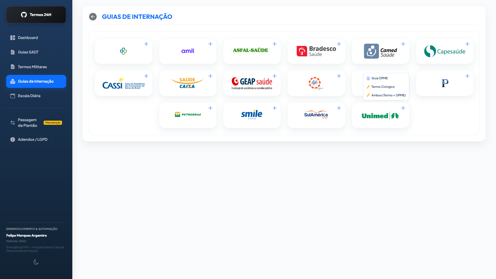
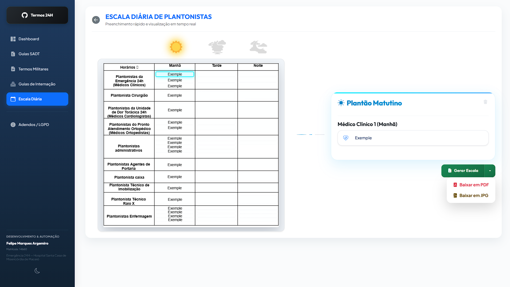
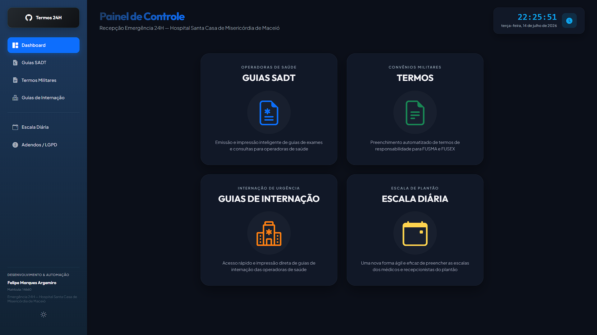

# Termos 24H — Automação de Termos Hospitalares (FUSMA e FUSEX)

> Sistema web corporativo de processamento distribuído desenvolvido para otimizar o fluxo de preenchimento de guias e termos de responsabilidade no setor de **Emergência 24H**, com suporte dedicado às regras operacionais dos convênios militares **FUSMA** e **FUSEX**.

O preenchimento manual de formulários e termos de consentimento no fluxo operacional da recepção hospitalar demanda alto controle de integridade de dados e tempo de processamento. O sistema **Termos 24H** automatiza este fluxo, mitigando riscos de preenchimento incorreto de variáveis críticas (ex: registros cadastrais, dados cronológicos de atendimento e identificadores de beneficiários), otimizando a eficiência do atendimento e a conformidade regulatória e de faturamento da instituição.

> [!NOTE]
> **Evolução Arquitetônica e Funcional:** Concebido inicialmente para a automação de termos de responsabilidade da FUSMA e FUSEX, o sistema evoluiu para uma plataforma integrada de suporte ao faturamento e atendimento de emergência, incorporando módulos de emissão de guias SADT, guias de internação e gestão de escalas internas.

## Módulos e Recursos do Sistema

1. **Mecanismo de Preenchimento Automatizado de Documentos PDF:** Geração dinâmica de termos baseada em entrada de dados estruturados com injeção direta de dados nos campos editáveis de formulários interativos PDF (AcroForms) através da biblioteca `pdf-lib`.
2. **Transferência Estruturada de Dados Operacionais:** Utilitário de validação e extração de dados do convênio militar FUSEX para a área de transferência em formato de texto padronizado, evitando redundância de digitação em sistemas terceiros.
3. **Mapeamento de Metadados Temporais:** Captura automatizada e padronização da data e hora do sistema operacional para garantir a integridade temporal no preenchimento de termos.
4. **Controle de Protocolo de Segurança Interna (Checklist):** Bloqueio preventivo que condiciona o encerramento do atendimento à confirmação de conformidade nos fluxos de envio de correio eletrônico e conferência de anexos obrigatórios do faturamento.
5. **Painel de Emissão de Guias de SADT:** Emissão dinâmica e impressão silenciosa baseada em `iframe` oculto para guias de 16 operadoras de saúde, habilitando a impressão de guias em branco ou preenchidas.
6. **Mecanismo de Roteamento de E-mail (Assistente Postal):** Detecção automatizada de regras de convênio ativo (FUSMA/FUSEX) e vinculação restritiva aos servidores de correio eletrônico correspondentes (Valentin ou Gmail) para mitigar falhas de endereçamento.
7. **Página de Emissão de Guias de Internação de Urgência:** Interface dedicada para a geração e impressão silenciosa de guias de internação clínica de 15 operadoras com total simplificação de campos obrigatórios.
8. **Módulo de Escala Diária de Plantonistas:** Preenchimento interativo de escalas operacionais por meio de hotspots gráficos clicáveis vinculados a formulários em etapas e geração de exportações (PDF/JPG) nomeadas de forma unívoca com registro temporal do faturamento.
9. **Modo Escuro Global (Visual Comfort):** Tratamento visual preventivo de fadiga ocular da equipe de faturamento e recepção em regime de plantão noturno, aplicando inversão de contraste cromático no visualizador de escalas e componentes.

## Evolução Recente: Antes vs. Depois

Para elevar a experiência do usuário e garantir conformidade rígida de segurança, o layout e o comportamento do formulário foram completamente otimizados:

| Recurso / Área | Como Era (Antes) | Como Ficou (Depois) |
| :--- | :--- | :--- |
| **Visualização de Data e Hora** | Exibia os números brutos (`DD/MM/AAAA` e `HH:MM`), ocupando colunas excessivamente largas sem feedback contextual. | **Frases Humanizadas Inline!** Exibe frases amigáveis como *"Hoje, Dia 10 de Julho de 2026"* e *"Hoje às 20:48 da Noite"*. O cursor revela os números brutos para digitação; ao clicar fora, o texto volta a ser amigável. O PDF final continua recebendo a data técnica de forma invisível. |
| **Limpeza e Privacidade** | Navegar entre convênios (FUSMA/FUSEX) ou sair do formulário mantinha as informações preenchidas nos campos, correndo risco de vazar dados do paciente anterior. | **Limpeza Inteligente por Eclusa!** Sair do formulário por qualquer meio (seta de voltar, menu lateral, sidebar) ativa uma limpeza profunda preventiva, resetando 100% dos inputs e excluindo dados temporários da memória. |
| **Preenchimento Automático (Autofill)** | O Chrome e outros navegadores bloqueavam a tela com popups oferecendo dados antigos de outros pacientes e davam alertas de "conexão insegura" no campo de validade. | **Bloqueio Total de Heurísticas!** Renomeamos o ID do campo de validade para evitar alertas falsos de cartão e alteramos a propriedade de autocomplete de todos os campos para `one-time-code`, desativando qualquer dropdown intrusivo do navegador. |
| **Design dos Inputs (Cápsulas)** | Usavam caixas de texto separadas de seus botões de atalho, com divisão visual marcada e sem destaque do foco do usuário. | **Cápsula Unificada!** Inputs e botões integrados se fundem em um visual elegante de "pílula única", com destaque de foco por brilho na cor tema correspondente a cada convênio (Azul para FUSMA, Verde para FUSEX). |
| **Ergonomia e Área de Trabalho** | O botão de cópia rápida do FUSEX ocupava um espaço gigante no rodapé, mudando o layout e forçando o operador a scrollar a tela constantemente. | **Foco e Ergonomia!** Os 4 campos necessários para cópia foram agrupados lado a lado no início. O botão de copiar dados retornou ao cabeçalho em tamanho discreto, destravando e mudando de cor dinamicamente com base nas validações. |
| **Limite de Digitação** | Campos de data e hora do atendimento permitiam digitação infinita de caracteres, desconfigurando os PDFs finais. | **Travas de Comprimento e Máscara!** Inclusão de `maxlength` rígido (10 para data, 5 para hora) combinados com máscara automática de hora no JS (insere `:` automaticamente ao digitar). |
| **Responsividade Vertical** | O Dashboard inicial exigia barra de rolagem vertical em monitores antigos ou telas menores como 1366x768. | **Compactação Responsiva sem Scroll!** Media queries baseadas na altura do monitor encolhem os ícones e margens de forma inteligente para que o painel principal caiba 100% na tela de qualquer monitor sem barra de rolagem. |
| **Arquitetura de Software** | Monolito Organizado. Toda a inteligência da aplicação e lógica das telas residia em um arquivo unificado (`script.js`). | **Arquitetura em Camadas (Modularizada)!** Código distribuído de forma limpa em submódulos específicos na pasta `js/` (`core.js`, `escala_diaria.js`, `guias_medicas.js`, `termos_militares.js`), facilitando a manutenção e a escalabilidade do sistema. |

### Comparação Visual de Telas (Antes vs. Depois)
#### 1. Painel de Controle (Dashboard)
*Esta tela de controle centraliza as estatísticas, o relógio e a navegação do sistema.*


#### 2. Página de Seleção de Termos (FUSMA / FUSEX)
| Como Era (Antes) | Como Ficou (Depois) |
| :---: | :---: |
|  |  |

#### 3. Formulário FUSEX
| Como Era (Antes) | Como Ficou (Depois) |
| :---: | :---: |
|  |  |

#### 4. Formulário FUSMA
| Como Era (Antes) | Como Ficou (Depois) |
| :---: | :---: |
|  |  |

#### 5. Painel SADT
| Como Era (Antes) | Como Ficou (Depois) |
| :---: | :---: |
|  |  |

#### 6. Página de Guias de Internação (Nova Funcionalidade)
*Esta tela de guias de internação de urgência permite a emissão rápida direta.*



#### 7. Módulo de Escala Diária e Modo Escuro Global
*Esta tela exibe o preenchimento da escala diária de plantonistas e a interface integrada no Modo Escuro.*



## Tecnologias Utilizadas

- **PDF24 Toolbox** — Ferramenta utilizada para criar e configurar os campos editáveis (formulários interativos) nos PDFs oficiais.

- **pdf-lib** — Biblioteca JavaScript para leitura dos templates PDF e injeção dos dados em tempo real.

- **Bootstrap 5 + Bootstrap Icons** — Interface limpa, responsiva e intuitiva.

- **HTML5 + CSS3 + JavaScript Vanilla** — Aplicação executada inteiramente no lado do cliente (client-side), sem dependências de servidor, compatível com navegadores modernos.

## Conformidade com a LGPD

O sistema foi projetado para garantir a privacidade dos dados sensíveis dos pacientes, em conformidade com a LGPD. O **Termos 24H** opera com arquitetura de Processamento Local (Client-Side):

- **Sem banco de dados** — Nenhum dado é enviado ou armazenado em servidor.
- **Memória volátil** — Toda geração de PDF acontece apenas na memória do navegador.
- **Sem localStorage clínico** — Os dados são descartados assim que a página é recarregada ou o atendimento é concluído.
- **Criptografia HTTPS de ponta a ponta** — A integração de e-mail e comunicação com o Webmail é feita exclusivamente através do protocolo seguro HTTPS.

## Estrutura do Projeto

```
termos-24h/
├── index.html          # Página principal
├── script.js           # Lógica de preenchimento, validação, geração de PDF, impressão e roteamento de termos militares
├── style.css           # Estilos, responsividade vertical, otimizações para telas AOC/1366x768 e animações
├── js/
│   ├── core.js         # Gerenciamento central do aplicativo (SPA, relógio, lembretes de escala, tema global)
│   ├── escala_diaria.js # Lógica de hotspots, formulário passo a passo, renderização e download da escala diária
│   ├── guias_medicas.js # Validação, máscaras de inputs e preenchimento de guias de internação e SADT
│   └── termos_militares.js # Preenchimento, checklist e exportação de termos militares (FUSEX/FUSMA)
└── assets/
    ├── escala_diaria/  # Imagens de turno, template PDF e PDFs de visualização
    ├── fusma/          # Capa FUSMA.jpg, favicon FusmaPage.png e template termo_fusma_preenchivel.pdf
    ├── fusex/          # Capa FUSEX.jpg, favicon FusexPage.png e template termo_fusex_preenchivel.pdf
    ├── guias internacao/ # Templates oficiais PDF das 15 operadoras de internação de urgência
    ├── guias sadt/     # Templates oficiais PDF preenchíveis das 16 operadoras de saúde
    ├── icons_operadoras_de_saude/ # Logotipos das operadoras (incluindo as novas SUS.jpg e EMBRATEL.jpg)
    ├── Initial.png     # Logotipo/Favicon padrão do site
    └── screenshots/    # Capturas de tela da aplicação para o README
```

## Implantação e Execução

Por ser um sistema estático que opera inteiramente no lado do cliente (Client-Side Single Page Application), a implantação não exige servidores de aplicação (como Node.js ou PHP) ou bancos de dados relacionais.

### Requisitos de Hospedagem
* **Servidor Web:** Compatível com qualquer servidor de arquivos estáticos, incluindo Microsoft IIS, Apache HTTP Server, Nginx ou soluções de intranet local.
* **Protocolo de Comunicação:** Recomenda-se a ativação obrigatória do protocolo seguro HTTPS no servidor para garantir a conformidade com a LGPD nas conexões externas à rede do hospital.

### Execução em Ambiente de Homologação / Desenvolvimento
1. Clone ou extraia os arquivos mantendo a estrutura de diretórios do projeto.
2. Sirva a pasta raiz da aplicação por meio de um servidor HTTP local (ex: Extensão Live Server do VS Code, Python `http.server`, ou módulo `http-server` do npm).
3. *Nota:* Recomenda-se evitar a abertura direta de arquivos via protocolo `file:///` no Chrome para garantir o funcionamento correto de requisições assíncronas do visualizador PDF (pdf-lib).

## Autor

**Felipe Marques Argemiro**  
Matrícula: 14660  
Setor: Emergência 24H 
HOSPITAL SANTA CASA DE MISERICORDIA DE MACEIÓ

## Capturas de Tela

### Painel de Controle (Dashboard)


### Página de Seleção de Termos (FUSMA / FUSEX)


### Página FUSEX


### Página FUSMA


### Modal Guias SADT


### Prompt de Impressão Direta (Exemplo Unimed)


### Página de Guias de Internação (Nova Funcionalidade!)


### Módulo de Escala Diária de Plantonistas


### Interface com Modo Escuro Global Ativo


---

*Ferramenta desenvolvida para uso interno no Setor de Emergência 24H, com foco na otimização de processos e na proteção de dados sensíveis.*