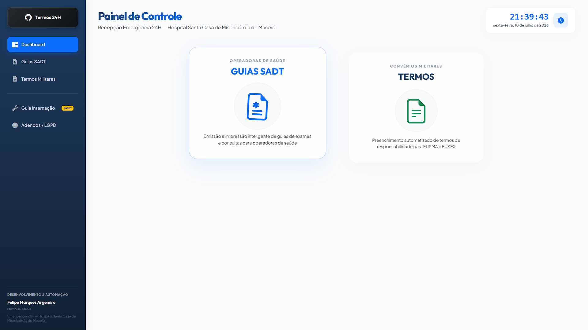
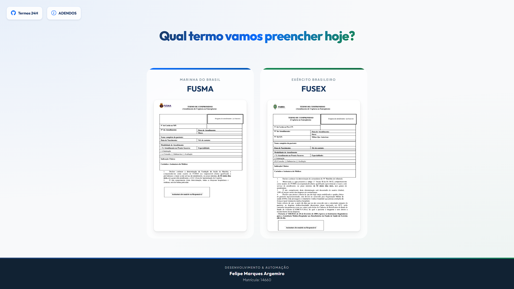
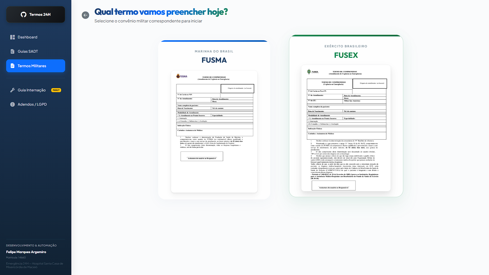
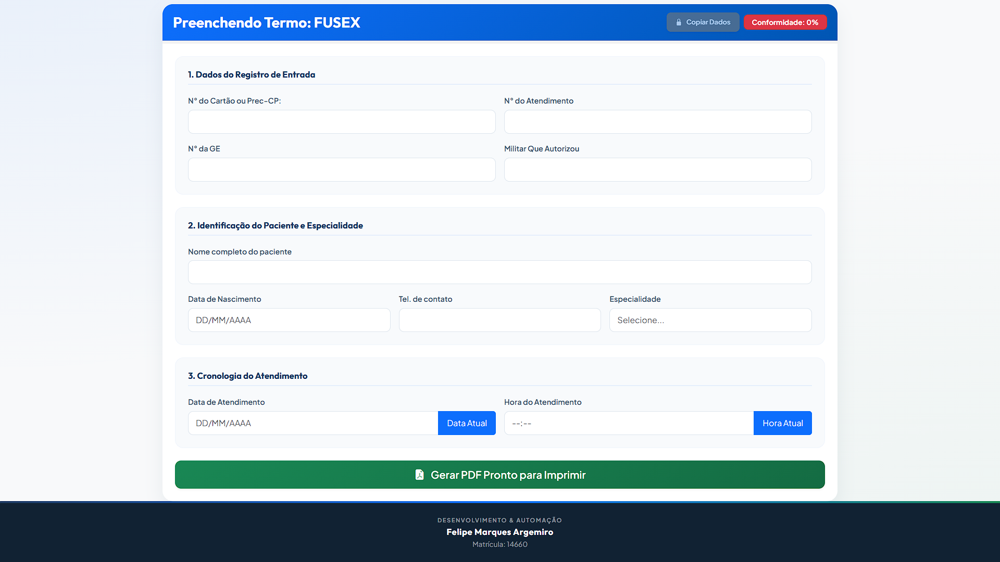
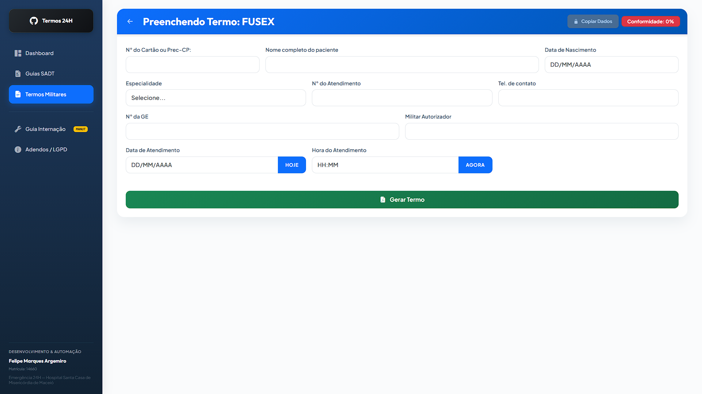
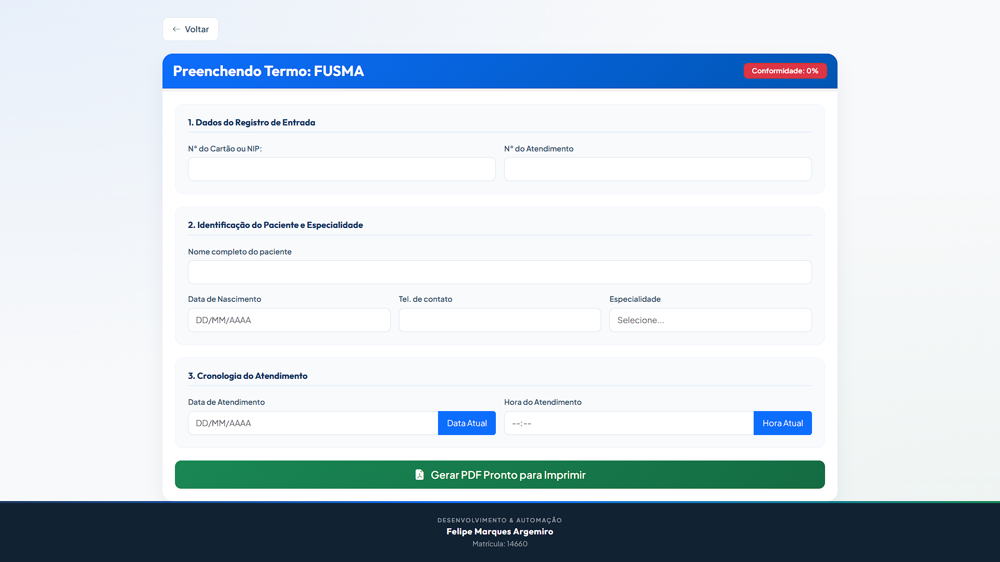
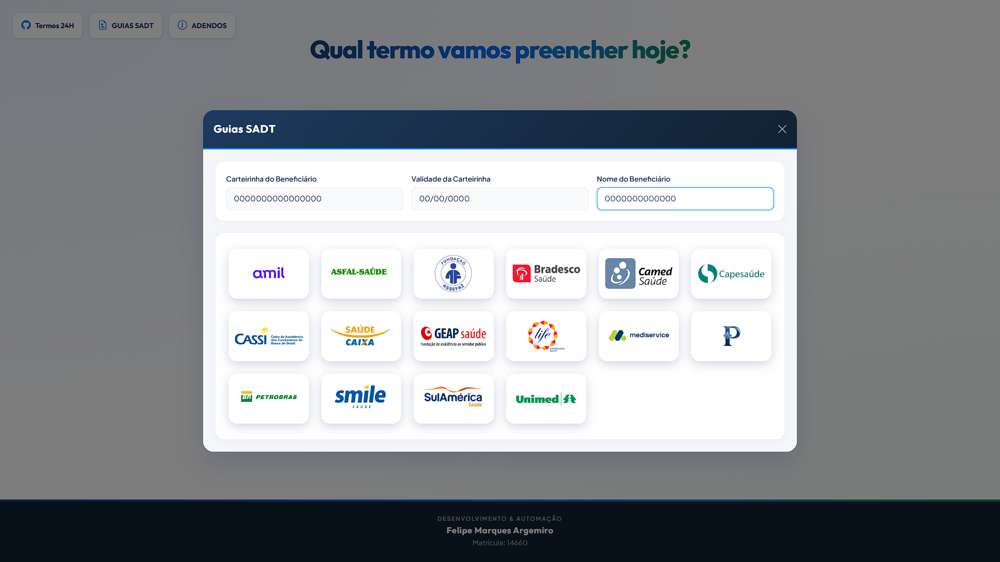
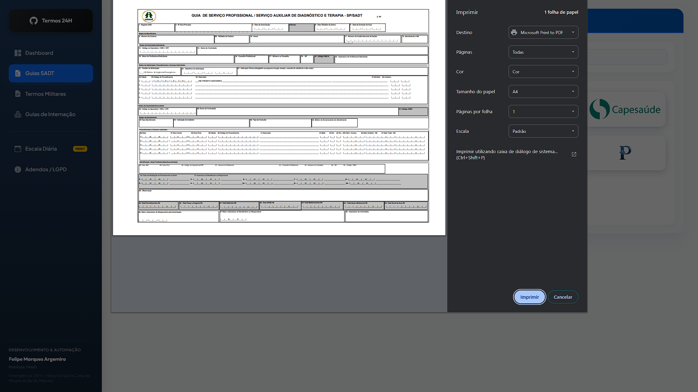

# Termos 24H — Automação de Termos Hospitalares (FUSMA e FUSEX)

> Sistema web desenvolvido para otimizar o fluxo de preenchimento de guias e termos de responsabilidade no setor de **Emergência 24H**, voltado especificamente para os convênios militares **FUSMA** e **FUSEX**.

O preenchimento manual dessas guias no dia a dia da recepção hospitalar exige atenção constante e consome tempo que poderia ser dedicado ao atendimento do paciente.  
O sistema **Termos 24H** foi desenvolvido para otimizar esse processo e reduzir erros de digitação em campos críticos, como número do cartão, data de nascimento e dados do atendimento, proporcionando maior agilidade e confiabilidade ao fluxo de trabalho.

> [!NOTE]
> **Visão de Futuro e Evolução:** Embora a ferramenta tenha sido concebida inicialmente para os fluxos exclusivos de **FUSMA** e **FUSEX**, ela acabou abrindo as portas para novas ideias de otimização administrativa no setor. Outras automações já estão sendo ativamente trabalhadas e implementadas para integrar e simplificar cada vez mais os processos do faturamento e atendimento.

## Acesso / Demo ao Vivo

O sistema está hospedado no **GitHub Pages** e pode ser acessado diretamente de qualquer computador da recepção:

## O que o projeto faz

1. **Preenchimento Automatizado de PDFs**  
   O operador preenche um formulário digital limpo com os dados do paciente (cartão, atendimento, nome, nascimento, telefone e especialidade). O sistema gera automaticamente o PDF oficial com os dados perfeitamente posicionados, pronto para impressão e assinatura.

2. **Cópia Rápida FUSEX**  
   Botão de validação que copia os dados básicos do atendimento em formato de texto estruturado para a área de transferência, evitando digitação repetida.

3. **Cronologia com 1 Clique**  
   Botões de atalho que capturam automaticamente a data e hora atuais do computador.

4. **Checklist de Protocolo de Segurança**  
   Modal de fechamento que impede o encerramento do atendimento até que o operador confirme o envio de e-mails e anexos exigidos, garantindo a conformidade com os protocolos internos.

5. **Painel de Emissão de Guias SADT (Novo!)**  
   Painel inteligente que permite o preenchimento de guias SADT de 16 operadoras de saúde diferentes. Ao preencher a carteirinha, validade e nome do beneficiário, o sistema desbloqueia os planos. O clique em uma operadora aciona a **impressão silenciosa direta e automática** via iframe oculto, abrindo o prompt do Ctrl+P por cima do site atual sem abrir abas adicionais.

6. **Assistente Postal e Integração de E-mail (Novo!)**  
   Mecanismo integrado ao checklist que detecta dinamicamente o convênio ativo (FUSMA com Valentin ou FUSEX com Gmail) e trava os endereços de destino corretos. Isso **evita falhas de envio e elimina erros operacionais** (como a digitação errada do e-mail ou o envio acidental de documentos sensíveis para o convênio incorreto). Um clique no botão dispara a abertura do Webmail Seguro (Roundcube) em uma nova aba com o assunto formatado de forma profissional (identificando o nome do paciente, data, hora e período correspondente ao plantão: Manhã, Tarde, Noite ou Madrugada) e marca automaticamente a conclusão da tarefa no checklist.

7. **Módulo de Internação (Em Construção / Futuro!)**  
   Atalho pré-configurado com visual de manutenção no menu flutuante. Um clique no botão abre o modal informativo avisando que a funcionalidade está sendo ativamente desenvolvida para integrar no futuro o fluxo de guias de internação.

## 🚀 Evolução Recente: Antes vs. Depois

Para elevar a experiência do usuário e garantir conformidade rígida de segurança, o layout e o comportamento do formulário foram completamente otimizados:

| Recurso / Área | Como Era (Antes) | Como Ficou (Depois) |
| :--- | :--- | :--- |
| **Visualização de Data e Hora** | Exibia os números brutos (`DD/MM/AAAA` e `HH:MM`), ocupando colunas excessivamente largas sem feedback contextual. | **Frases Humanizadas Inline!** Exibe frases amigáveis como *"Hoje, Dia 10 de Julho de 2026"* e *"Hoje às 20:48 da Noite"*. O cursor revela os números brutos para digitação; ao clicar fora, o texto volta a ser amigável. O PDF final continua recebendo a data técnica de forma invisível. |
| **Limpeza e Privacidade** | Navegar entre convênios (FUSMA/FUSEX) ou sair do formulário mantinha as informações preenchidas nos campos, correndo risco de vazar dados do paciente anterior. | **Limpeza Inteligente por Eclusa!** Sair do formulário por qualquer meio (seta de voltar, menu lateral, sidebar) ativa uma limpeza profunda preventiva, resetando 100% dos inputs e excluindo dados temporários da memória. |
| **Preenchimento Automático (Autofill)** | O Chrome e outros navegadores bloqueavam a tela com popups oferecendo dados antigos de outros pacientes e davam alertas de "conexão insegura" no campo de validade. | **Bloqueio Total de Heurísticas!** Renomeamos o ID do campo de validade para evitar alertas falsos de cartão e alteramos a propriedade de autocomplete de todos os campos para `one-time-code`, desativando qualquer dropdown intrusivo do navegador. |
| **Design dos Inputs (Cápsulas)** | Usavam caixas de texto separadas de seus botões de atalho, com divisão visual marcada e sem destaque do foco do usuário. | **Cápsula Unificada!** Inputs e botões integrados se fundem em um visual elegante de "pílula única", com destaque de foco por brilho na cor tema correspondente a cada convênio (Azul para FUSMA, Verde para FUSEX). |
| **Ergonomia e Área de Trabalho** | O botão de cópia rápida do FUSEX ocupava um espaço gigante no rodapé, mudando o layout e forçando o operador a scrollar a tela constantemente. | **Foco e Ergonomia!** Os 4 campos necessários para cópia foram agrupados lado a lado no início. O botão de copiar dados retornou ao cabeçalho em tamanho discreto, destravando e mudando de cor dinamicamente com base nas validações. |

### 🖼️ Comparação Visual de Telas (Antes vs. Depois)

*(Nota: As novas capturas do "Depois" aparecerão assim que você salvar os prints na pasta assets/screenshots com os nomes correspondentes)*

#### 📊 1. Painel de Controle (Dashboard) — [NOVA PÁGINA!]
*Esta tela de controle não existia na versão anterior. Ela centraliza as estatísticas, o relógio e a navegação do sistema.*



#### 🖥️ 2. Página de Seleção de Termos (FUSMA / FUSEX)
| Como Era (Antes) | Como Ficou (Depois) |
| :---: | :---: |
|  |  |

#### 🟢 3. Formulário FUSEX
| Como Era (Antes) | Como Ficou (Depois) |
| :---: | :---: |
|  |  |

#### 🔵 4. Formulário FUSMA
| Como Era (Antes) | Como Ficou (Depois) |
| :---: | :---: |
|  |  |

#### 📁 5. Painel SADT
| Como Era (Antes) | Como Ficou (Depois) |
| :---: | :---: |
|  |  |

## Tecnologias Utilizadas

- **PDF24 Toolbox** — Ferramenta utilizada para criar e configurar os campos editáveis (formulários interativos) nos PDFs oficiais.

- **pdf-lib** — Biblioteca JavaScript para leitura dos templates PDF e injeção dos dados em tempo real.

- **Bootstrap 5 + Bootstrap Icons** — Interface limpa, responsiva e intuitiva.

- **HTML5 + CSS3 + JavaScript Vanilla** — Aplicação executada inteiramente no lado do cliente (client-side), sem dependências de servidor, compatível com navegadores modernos.

- **Google Antigravity** — ferramenta de assistência ao desenvolvimento e otimização do projeto.  
  [https://antigravity.google/](https://antigravity.google/)

## Conformidade com a LGPD

O sistema foi projetado para garantir a privacidade dos dados sensíveis dos pacientes, em conformidade com a LGPD. O **Termos 24H** opera com arquitetura de Processamento Local (Client-Side):

- **Sem banco de dados** — Nenhum dado é enviado ou armazenado em servidor.
- **Memória volátil** — Toda geração de PDF acontece apenas na memória do navegador.
- **Sem localStorage clínico** — Os dados são descartados assim que a página é recarregada ou o atendimento é concluído.
- **Criptografia HTTPS de ponta a ponta** — A integração de e-mail e comunicação com o Webmail é feita exclusivamente através do protocolo seguro HTTPS.

## Estrutura do Projeto

```
termos-24h/
├── index.html          # Página principal
├── script.js           # Lógica de preenchimento, validação, geração de PDF e impressão
├── style.css           # Estilos e responsividade
└── assets/
    ├── FUSEX.jpg       # Imagens de fundo
    ├── FUSMA.jpg       # Imagens de fundo
    ├── Initial.png     # Logotipo/Favicon padrão do site
    ├── guias sadt/     # Templates oficiais PDF preenchíveis das 16 operadoras de saúde
    ├── icons_operadoras_de_saude/ # Logotipos das operadoras de saúde
    └── screenshots/    # Capturas de tela da aplicação para o README
```

## Como executar localmente

1. Mantenha a estrutura de pastas acima.
2. Abra o arquivo `index.html` diretamente no navegador, ou
3. Use a extensão **Live Server** do VS Code para melhor experiência.

> Não é necessário build, servidor backend ou instalação de dependências. Tudo roda no navegador.

## Autor

**Felipe Marques Argemiro**  
Matrícula: 14660  
Setor: Emergência 24H 
HOSPITAL SANTA CASA DE MISERICORDIA DE MACEIÓ

## Capturas de Tela

### Painel de Controle (Dashboard)


### Página de Seleção de Termos (FUSMA / FUSEX)


### Página FUSEX


### Página FUSMA


### Modal Guias SADT


### Prompt de Impressão Direta (Exemplo Unimed)


---

*Ferramenta desenvolvida para uso interno no Setor de Emergência 24H, com foco na otimização de processos e na proteção de dados sensíveis.*